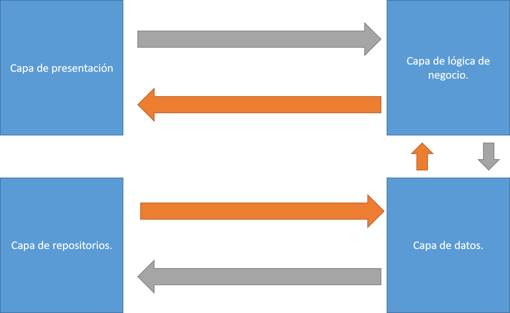

# Horrografía

**Elaborado por:** Adrián Sibaja

## Requisitos

    1.  La versión mas reciente de .NET.
    2.  Un IDE como Visual Studio 2022.
    3.  XAMPP para abrir la conexión MySQL.
    4.  Un administrador para Mysql como HeidiSQL.

## Como construir la aplicación localmente

    1.  Se instaló la herramienta XAMPP para construir un servidor MySQL local.
    2.  Luego se instaló una herramienta administrativa para manejar las solicitudes de la base de datos. En este caso se utilizó 'HeidiSQL'.
    3.  Se prende el servidor MySQL en XAMMP y seguidmamente se crea una base de datos en HeidiSQL.
    4.  Dentro de la base de datos recientemente generada vamos a crear un super usuario.
        https://tableplus.com/blog/2018/10/how-to-create-a-superuser-in-mysql.html
    5.  Una vez tengamos el super usuario y la base de datos, vamos al archivo 'Horrografia/Server/appsettings.json' y cambiamos los datos en la línea #3, titulada DefaultConnection, a los datos correspondientes de nuestra conexión. 
    6.  Luego de esto, generamos las tablas correspondientes. Para ello vamos al archivo 'Horrografía/DataBase/Consultas-Horrografía.sql' y copiamos y pegamos las tablas del archivo en nuestra base de datos y las generamos. 
    7. Luego de esto, dentro del IDE de visual studio, corremos el comando 'Update-Database'. Este comando genera las tablas esenciales de autorización.
    8. Luego de esto se debe construir el proyecto, si está en Visual Studio puede utilizar la opción de build.

## Como correr la aplicación

Una vez construida la aplicación solo se debe correr el comando 'dotnet watch run' dentro la carpeta del servidor para iniciar la página web.

## Explicación de la arquitectura

El proyecto se elaboró mediante el framework de Blazor WebAssembly, por lo que consta de dos proyectos principales: el cliente y el servidor. El cliente se encarga de la interfaz y lógica de usuario mientras que el servidor se encarga de leer y escribir a la base de datos.

A continuación se describirán las distintas capas utilizadas.

### Capa de presentación

La capa de presentación consta de las distintas páginas del cliente. Estas páginas son archivos razor y se encuentran en Horrografía/Client/Pages. Cada página tiene su lógica correspondiente en el archivo .razor.cs de su mismo nombre ya que se utilizó la metodología 'code behind'.

Dentro de estos documentos .razor.cs usualmente se inyectan los servicios de la capa de negocio la cual va a ser descrita posteriormente.

### Capa de lógica de negocio

Dentro de esta capa se encuentran los servicios que son inyectados a las páginas. Estos servicios se encargan de revisar la lógica correspondiente y utilizan un cliente https para llamar al API de la base de datos de la siguiente capa con el fin de escribir o leer datos.

Para esta aplicación se decidió elaborar un servicio por cada tabla de la base de datos.

Estos servicios se encuentran dentro de 'Horrografia/Client/Data'.

### Capa de Datos

Es la capa encargada de generar y administrar la seguridad del API de la aplicación. Para ello se utilizan 'controllers' de .NET y se encuentran dentro de 'Horrografia/Server/Controllers'.

Al igual que los servicios, hay un controlador por tabla de la base de datos y cada uno tiene su repositorio correspondiente.

### Capa de repositorios

Los repositorios se encargan de escribir los comandos SQL en la base de datos, por lo que leen y escriben la información directamente.

## Para crear administradores

### Primera opción añadirlo dentro del código

Añadir correo en la lista Administradores en Horrografía/Server/SharedConstants.cs.

### Segunda opción añadirlo a mano.

Conseguir el id del rol y el id del usuario y crear una tabla aspnetuserroles.
